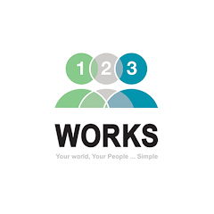

# Sibtain Raza

<!-- {: .no_toc }

  

    Table of contents
  

  {: .text-delta }
1. TOC
{:toc}

 -->
 

## Summary

- More than six years of experience in software engineering, currently working as Staff Software Engineer at 10Pearls, previously worked on Ride Hailing and Parcel Delivery Service (Partner and Passenger) mobile applications at Bykea. Revamped HBL Mobile Application and HBL Mobile Server (.Net) with new database architecture at Habib Bank Limited.
- Strong OOP concepts and good at analyzing problems and trying different approaches to solve it.
- Enthusiastic, motivated and ability to pay attention towards the details.
- Passionate to get things done, improve current way of doing, solve problems and learn new things.
- Comfortable working on Java and keep practicing competitive programming challenges through Hacker Rank.
- Worked on NodeJS and cloud platforms Heroku and Windows Azure (SQL Database) in MS course project.
- Good knowledge for android architectures and best practices recommended by google.
   

## Professional Experience

### Staff Software Engineer at 10Pearls, Pakistan (Sep 2021 – Present)

#### Languages

- Java
- Kotlin

#### Responsibilities

- Daily SCRUM, discussing business requirements, new features and enhancements in products.
- Mentors the other technical staff, assists them where needed and leads the effort in
- Takes on additional responsibilities as and when required and encourage cohesion & team building.
- Work on bug fixing and improving application performance.
- Continuously discover, evaluate, and implement new technologies to maximize development efficiency. - Jira tracking, code reviews, release documents, manage releases, managing source control.

### Android Developer at Bykea, Pakistan (May 2019 – Sep 2021)

Bykea is an all in one application for transportation, delivery and payment services.

#### Languages

- Java
- Kotlin

#### Responsibilities

- Daily SCRUM, discussing business requirements, new features and enhancements in products. - Design and integration of the new features for in the applications.
- Collaborate with cross-functional teams to define, design, and ship new features.
- Work with outside data sources and APIs.
- Continuously discover, evaluate, and implement new technologies to maximize development efficiency. - Jira tracking, code reviews, release documents, manage releases, managing source control.
- Secure application by obfuscation and SSL certificates.

#### Playstore Links

| Bykea                                                                                                                                                 | Bykea Partner                                                                                                                                                    |
| ----------------------------------------------------------------------------------------------------------------------------------------------------- | ---------------------------------------------------------------------------------------------------------------------------------------------------------------- |
|  |  |

### Product Development Engineer at Habib Bank Limited, Pakistan (June 2017 – May 2019)

#### Languages

- Java
- .Net

#### Responsibilities

- Design and integration of the new features for in the applications.
- Revamped mobile and server applications considering and followed best practices and architecture patterns.
- Collaborate with cross-functional teams and cross-departments to define, design, and ship new features.
- Discussion and implementation for business requirements document for fulfilling the requirements as
  proposed and meet the deadlines.
- Work on bug fixing and improving application performance.
- Jira tracking, code reviews, release documents, manage releases, managing source control.

#### Playstore Links

| HBL Mobile                                                                                                                                           |
| ---------------------------------------------------------------------------------------------------------------------------------------------------- |
|  |

 

## Freelance Projects

### 1. 123-Works (Ceimless) (React Native)&nbsp;&nbsp;

#### Playstore Links

| 123 Works                                                                                                                                              |
| ------------------------------------------------------------------------------------------------------------------------------------------------------ |
|  |

### 2. Carvan Driver - Daily transportation (Formerly Kidsway)  3. Carvan - Daily transportation (Formerly Kidsway)  4. Carvan Carpool

A reliable transportation service where commuters have guaranteed peace of mind that they are safe, comfortable, and trackable, travel time is reduced through route optimization, Driver and vehicle are certified while your loved ones can track your journey during your commute.

#### Playstore Links

| Carvan Driver                                                                                                                                       | Carvan Carpool                                                                                                                                           |
| --------------------------------------------------------------------------------------------------------------------------------------------------- | -------------------------------------------------------------------------------------------------------------------------------------------------------- |
| <a href="https://play.google.com/store/apps/details?id=com.kidsway.driver"> |  |

### 5. Dator (Android Application)&nbsp;&nbsp;

An application for agents for collection of information from site visits, courts and warrants against the defaulters. Considering the different dynamic form submission against different visit type.

### 6. Mandi Rates (Android Application - Kotlin and Back-end PHP)&nbsp;&nbsp;

### 7. ERC-Monitoring (Android Application - Kotlin)&nbsp;&nbsp;

### 8. Kharidaar (Android Application, Barcode Scanning, Beacon and Back-end PHP)&nbsp;&nbsp;

A smart cart app, by which you can create wish list by adding visible products or by scanning their barcode, discounts are applied after scanning Beacon, visibility for each product details and calculated with discounts (if applicable) are also visible, checkout feature is also available and history for each checkout is also maintained.

### 9. E-Health System (Android Application, Firebase Cloud Messaging and Back-end PHP)&nbsp;&nbsp;

Health monitoring device will monitor the patient and provide the abnormal activity to the concerned doctor and the guardian of that patient on their web and android application using FCM.

 

## Educational Projects

### MS in Data Engineering and Information Management

HS-SMS Caster is an Android application and it utilizes Microsoft Azure SQL Database as a Service. All contacts of your phone are backed up on an online server which allows you send multiple text messages to multiple contact groups simultaneously using Twilio API. Node.js is used as a middleware for server-side communication which is deployed on Heroku.

### BS in Computer Engineering

Geo-Fencing Enabled EC System is mobile based application; whose aim was to simplify employee-manager relationship. The Application not only made the relationship better but also advanced work-life balance. Microsoft SQL Server is used to maintain database and Node.js is used as a middleware for server-side communication.

 

## Skills

|                   |                                                                                                                                                             |
| ----------------- | ----------------------------------------------------------------------------------------------------------------------------------------------------------- |
| Technologies      | Mobile (Android), Node.js Server and .Net                                                                                                                   |
| Development Tools | Microsoft Visual Studio, Android Studio, Eclipse, NetBeans, WebStorm, SQL Server Management Studio, TOAD, SQLite Studio, Git Clients (SmartGit, SourceTree) |
| Cloud Platforms   | Microsoft Azure Cloud (SQL Database), Deployment on Heroku                                                                                                  |
| Databases         | MySQL, MS SQL Server, Oracle, SQLite.                                                                                                                       |
| Libraries/APIs    | Google Apis, Twilio Api (SMS), Zendesk, OneSignal, Picasso, Glide, Bluebird.                                                                                |

 

## Education

### MS in Data Engineering and Information Management (2017 - 2018) | 3.03 CGPA

NED University of Engineering & Technology, Karachi.

### BS in Computer Engineering (2013- 2016) | 3.26 CGPA

Sir Syed University of Engineering & Technology, Karachi.

 

## Certification and Courses

### 1. Java Spring

#### https://www.udemy.com/course/master-restful-apis-with-spring-boot/

|                  |                                                                     |
| ---------------- | ------------------------------------------------------------------- |
| Source Code      | https://github.com/smsibtainrn/springboot-buildingblocks            |
| Postman Document | https://documenter.getpostman.com/view/875302/UyxdMps5              |
| Heroku Link      | https://springboot-buildingblock.herokuapp.com (Deployed on Heroku) |

### 2. Python Flask

#### https://www.udemy.com/course/rest-api-flask-and-python

|                  |                                                            |
| ---------------- | ---------------------------------------------------------- |
| Course Leaning   | https://github.com/smsibtainrn/python-flask-server         |
| Hacker Rank Test | https://github.com/smsibtainrn/python-flask-hacker-rank    |
| Postman Document | https://documenter.getpostman.com/view/875302/UVsMtQEB     |
| Heroku Link      | https://smsrn-flask-app.herokuapp.com (Deployed on Heroku) |

### 3. Coding With Mosh

#### https://codewithmosh.com/p/the-ultimate-react-native-course

|                |                                           |
| -------------- | ----------------------------------------- |
| Course Leaning | https://github.com/smsibtainrn/DoneWithIt |
